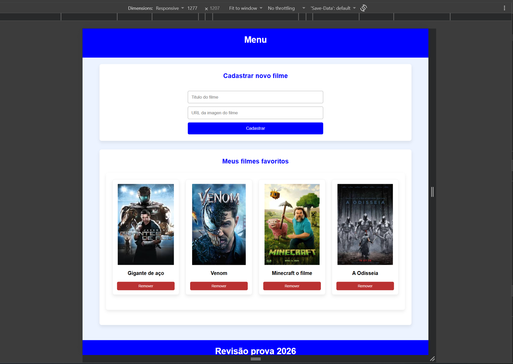
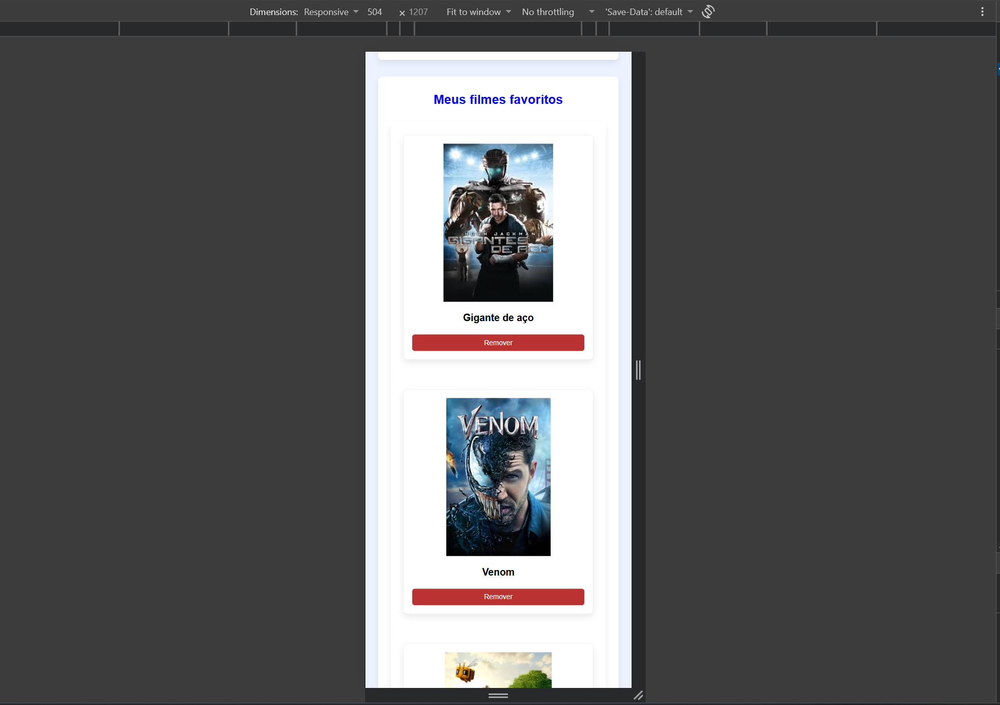

# Trabalho Acadêmico
Nesta tarefa academica foi utilizado html, css e java script **puros**, sem utilizar nenhum framework. Esta aplicação é um protótipo funcional que tem como objetivo gerenciar uma lista de filmes, realizando cadastros e os armazenando no local storage.
### Habilidades Aprendidas
- Estrutura semântica
- Metodologia Mobile First
- Responsividade Tablet, Desktop
- Interatividade
- Transições
- Manipulação do DOM
- Manipulação de arquivos .JSON
- Renderização de cards dinâmica
- Validação de formulários

## Demostração

### Desktop

### Mobile

